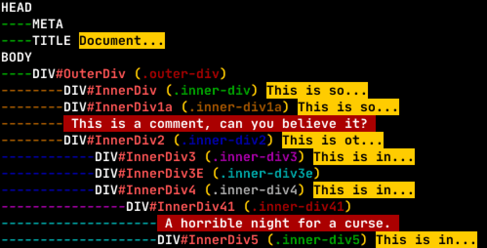

# Breaker
Recent I was writing a tool to scrape some HTML content, and while I was
successful, I realized what a chore it was running through thick, even
obfuscated HTML.

So, 'breaker' is a first attempt at writing something to help visualize the
stuff I found important as I crawled through the markup. There's often a lot of
noise, and I really wanted to focus on the heart of it.

(This wound up being very helpful the same day I finished it, so I know I'm on
the right path! :D)

## What Breaker Focuses On

- A tree-like representation of the DOM with IDs and classes presented in
  a compact manner.

- A unique color coding for each level of the tree, along with class names
  assigned a unique color to help better identify obfuscated class names.

- Showcases custom `data*-` attribute tags, while ignoring the common ones.

- Draws attention to inline comments

- Only shows a small excerpt of the actual text content to get your bearings

- Skip elements with no text inside them

- You can turn off most of these, or adjust indentation, etc.

## What's Next?
- I'd like to try to actually detect _patterns_ and draw attention to them.
  Such as blocks of HTML with different content, but similar class/ID
  assignments. (Which might indicate content blocks.)

- Anything else that seems helpful as I continue my scraping journey.

## Anyway...
Feel free to drop suggestions, or report bugs in the issues section.

---
Fortyseven (https://Network47.xyz)
2021-09-25
